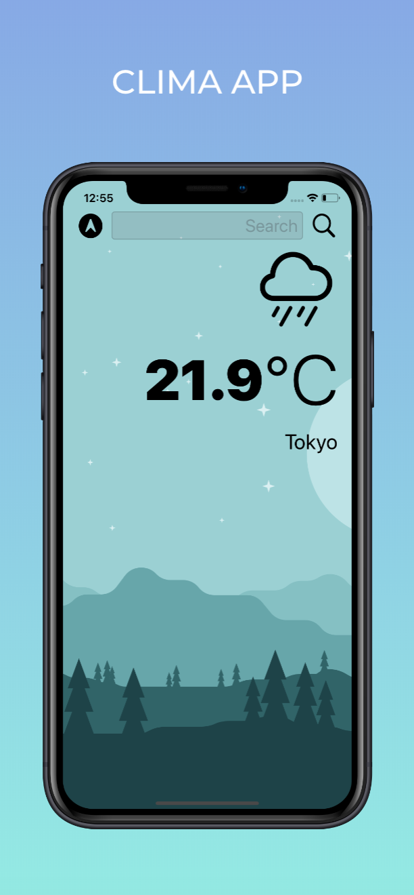
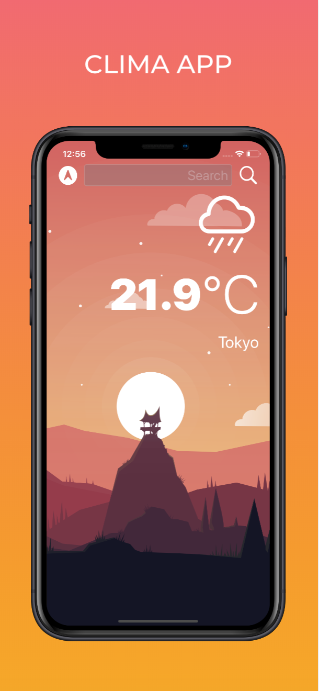

# Clima App
> With Clima App, you'll be able to check the weather for the current location based on the GPS data from the iPhone as well as by searching for a city manually. 

* Model View Controller (MVC) patern
* APIs to fetch live weather data from Open Weather Map
* Dark-mode enabled app
* How to use vector images as image assets
* UITextField to get user input. 
* Delegates
* Swift protocols 
* Swift extensions
* Swift guard keyword. 
* Swift computed properties.
* Swift closures and completion handlers.
* URLSession and HTTP requests.
* Parse JSON (Codable protocol) 
* Dispatch Queue to fetch the main thread.
* Learn to use Core Location to get the current location from the phone GPS. 
